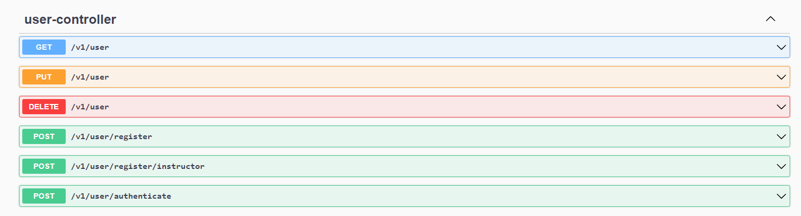
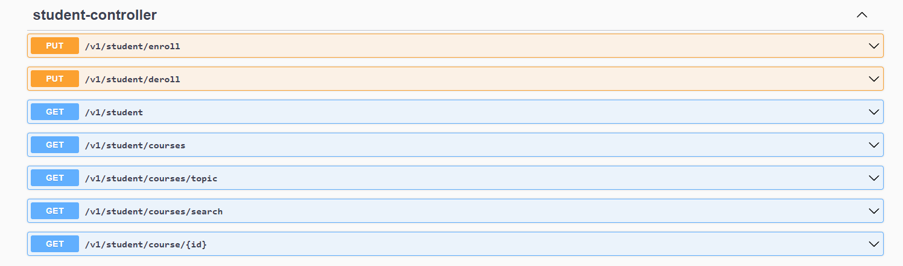
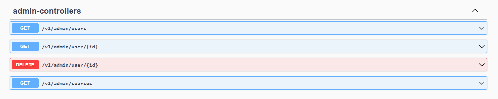
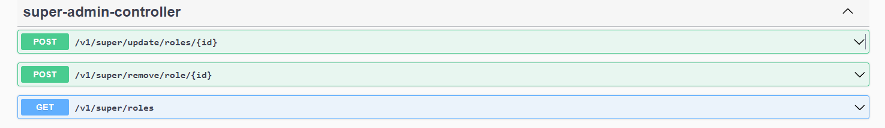
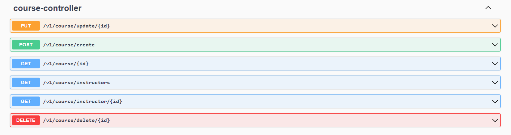

# Course enrolment API
An API project for managing courses.

### Features:
- Users can signup as students or instructors.
- Stuedents can enroll or disenroll from courses.
- Instructors can create, delete or update courses.
- Admins and super-admins can manage users, instructors and even courses.

### Technology used:
- Java
- Spring-boot
- Spring-security
- Json Web Token
- Spring-data-jpa
- REST Api
- PostgresQL

### API List:
- **Users Api**

- **Students Api**

- **Admin Api**

- **Super-admin Api**

- **Course Api**
